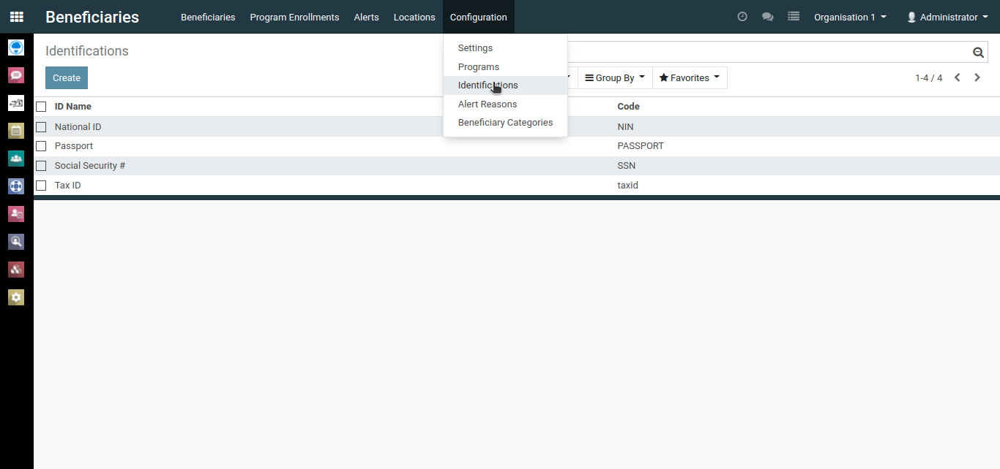
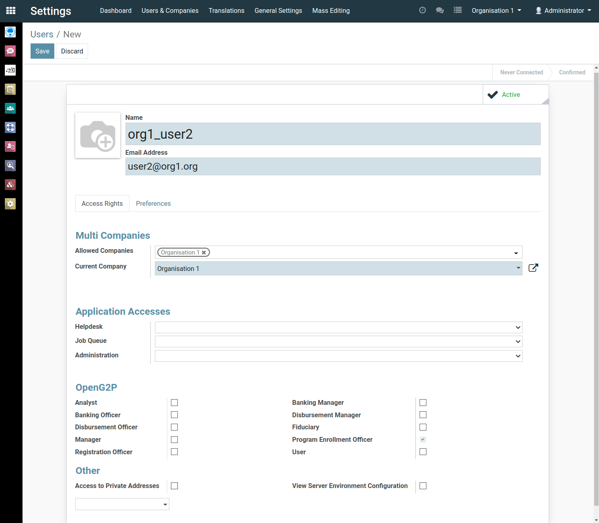

# Administrator's Guide for MOSIP's OpenG2P

This guide helps the administrators in configuring and using the OpenG2P portal. 

To know more about installation instructions, refer [kubernetes install instructions](https://github.com/mosip/openg2p-erp-docker/tree/develop#installation-on-kubernetes-cluster) and [standalone install instructions](./openg2p-setup-and-install.md).

After installing the OpenG2P framework, Administrator user is auto created.

## Glossary

This section describes the terminology used in OpenG2P.

* `Company`: A Company in OpenG2P is equivalent to an *Organization* that is providing benefits to beneficiaries.
* `Program`: A Program in OpenG2P is equivalent to a benefit scheme. Each organization could be running multiple such *programs* to benefit the beneficiaries.
* `Beneficiary`: A Beneficiary in OpenG2P is equivalent to a person who is eligible for (or one who is already) receiving benefit from some particular program from any organization.
* `Program Enrollment`: A beneficiary could be enrolled into multiple programs. The mapping of each *beneficiary* to a *program* that they are enrolled into is called  *Program Enrollment* in OpenG2P.
    * *Program Enrollment start date* describes the date on which the *beneficiary* started receiving the benefit under the given *program*.
    * *Program Enrollment end date* describes the date on which the *beneficiary* is going to stop receiving benefit under the given *program*.
    * *Program Enrollment amount* describes the amount that the *beneficiary* would receive for each benefit period under the given *program*.
    * *Program Enrollment total remuneration* describes the total amount that the *beneficiary* has received till date under the given *program*.
* `User`: A *user* in OpenG2P is equivalent to a Program Enrollment Officer under each *organization*  who is responsible for creating *programs*, creating/enrolling/disenrolling *beneficiaries* into/from their *organization programs*.
* `Administrator` or `admin` is also a *user* who has access to all the apps and settings on OpenG2P. Additionally, the admin also has access to all the organizations, users, programs, beneficiaries, and program enrollments.
* `Identification`- is an object in OpenG2P which is associated with a beneficiary. A beneficiary could be identified by multiple such IDs- passport, Tax ID, etc.

##  Identification creation

The identification should also be configured before installation using the following environment variables.
  - `PROGRAM_ENROLLMENT_ON_IMPORT_BENEFICIARY_BASE_ID_LABEL`: `Tax ID`
  - `PROGRAM_ENROLLMENT_ON_IMPORT_BENEFICIARY_BASE_ID`: `taxid`
 
This section describes how to configure/create identifications for beneficiaries.

* Navigate to *Beneficiaries* app -> Configuration menu -> Identification.
* Create a new Identification with the following properties.
  - ID Name: `Tax ID`
  - Code: `taxid`

## Organization creation

Follow these instructions to create a new company/organization in OpenG2P.

* Navigate to *Settings* app -> *Users & Companies* -> *Companies*.
* Create a new company with the required details.

* Since `admin` has created the companies, by default admin is a part of all of the companies/organizations.
* On the top right corner, the list of available companies/organizations for the currently logged in user (i.e., `admin`) will be reflected in the dropdown
* To be able to switch between companies, the admin needs to logout and login again.
* For each company in the dropdown, navigate to *Settings* app -> *General Settings* menu and change the *Background Image* as required.

## User creation

Following section describes how to create *users* (Program Enrollment Officers) within each company.

* Select the company/organization for which the user has to be created (from the company dropdown on the top right corner).
* Create a new user with the required email and name.
* Select blank against *Helpdesk* under Application Accesses section.
* Under OpenG2P section, assign only the `Program Enrollment Officer` role to the user and remove all the other roles. 
* Under Others section, uncheck *Access to Private Addresses*
* Click *Save* to create the user.
* Upon creating user(s), select the user(s), click on *Action* -> *Change Password*.
* Assign some temporary password to each user, and instruct the users to change their password immediately upon logging in.

The image below reflects the settings required for creating a user.

