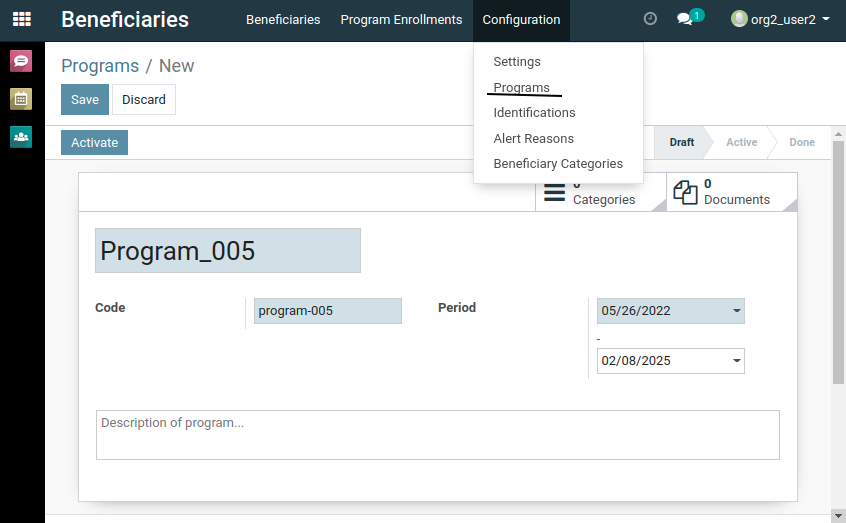

# Manual for Usage of OpenG2P ([MOSIP](/../../))

## 1. Contents

- [Contents](#1-contents)
- [Glossary](#2-glossary)
- [Administrator manual](#3-administrator-manual)
  - [Identification creation](#31-identification-creation)
  - [Organization creation](#32-organization-creation)
  - [User creation](#33-user-creation)
- [Program Enrollment Officer manual](#4-program-enrollment-officer-manual) (User Manual)
  - [Creating a Program](#41-creating-a-program)
  - [Importing CSV/XLS of Beneficiaries](#42-importing-csvxls-of-beneficiaries)
  - [Enrolling Beneficiaries into Programs](#43-enrolling-beneficiaries-into-programs)
  - [Disenrolling Beneficiaries from Programs](#44-disenrolling-beneficiaries-from-programs)
  - [Exporting to CSV/XLS](#45-exporting-to-csvxls)
- [Annexures](#5-annexures)
  - [CSV structure for Importing](#51-csv-structure-for-importing)
  - [Filtering Beneficiaries in the list](#52-filtering-beneficiaries-in-the-list)

## 2. Glossary

- `Company`: A *Company* in OpenG2P is equivalent to an *Organization* that is providing so and so Benefits to Beneficiaries.
- `Program`: A *Program* in OpenG2P is equivalent to a benefit scheme. Each organisation could be running multiple such *programs*
- `Beneficiary`: A *Beneficiary* in OpenG2P is equivalent to a person who is eligible for (or one who is already) receiving some benefit from some particular *program* from any *organization*.
- `Program Enrollment`: A *beneficiary* could be enrolled into multiple *programs*. The mapping of each *beneficiary* to each *program* they are enrolled into is called a *Program Enrollment* in OpenG2P.
  - *Program Enrollment start date* describes the date on which this *beneficiary* started receiving the benefit under the given *program*.
  - *Program Enrollment end date* describes the date on which this *beneficiary* is going to stop receiving benefit under the given *program*.
  - *Program Enrollment amount* describes the amount that this *beneficiary* would receive for each benefit period under the given *program*.
  - *Program Enrollment total remuneration* describes the total amount that this *beneficiary* has received till date under the given *program*.
- `User`: A *user* in OpenG2P is equivalent to a Program Enrollment Officer under each *organisation*. Who is responsible for creating *programs*, creating/enrolling/disenrolling *beneficiaries* into/from their *organization* *programs*.
- `Administrator` or `admin` is also a *user* who has access to all the apps and settings on OpenG2P. Also has access to all the organizations, users, programs, beneficiaries, and program enrollments.

## 3. Administrator manual

Upon installing of the OpenG2P framework, Administrator (`admin`) user is auto created. The following section describes the workings and usage of `admin`.

### 3.1. Identification creation
- After installation of the framework, login as `admin`.
- Navigate to *Beneficiaries* app.
- Click on *Configuration*, then on *Identification*.
- Create a new Identification called with the following properties.
  - ID Name: `Tax ID`
  - Code: `taxid`
- Note: This identification should also be configured before installation using the following environment variables. Refer [kubernetes install instructions](https://github.com/mosip/openg2p-erp-docker/tree/develop#installation-on-kubernetes-cluster) and [standalone install instructions](./openg2p-setup-and-install.md). 
  - `PROGRAM_ENROLLMENT_ON_IMPORT_BENEFICIARY_BASE_ID_LABEL`: `Tax ID`
  - `PROGRAM_ENROLLMENT_ON_IMPORT_BENEFICIARY_BASE_ID`: `taxid`

### 3.2. Organization creation

Follow these instructions to create a new company/organization in OpenG2P.

- Login as `admin`.
- Navigate to *Settings* app.
- Click on *Users & Companies*, then on *Companies*.
- Create a new company here, with the required details.

- Since `admin` created the companies, `admin` is part of all of the companies/organizations by default.
- After creating companies, logout as `admin`, then login back as `admin` for the created companies to get reflected.
- The list of available companies/organizations for the currently logged in user (i.e., `admin`) will be reflected in the dropdown in the top right corner.
- For each company in the dropdown on the top right, navigate to *Settings* app, and then to *General Settings* Menu, and change the *Background Image* as required.

### 3.3. User creation

Following section describes how to create *users* (Program Enrollment Officers) within each company.

- Login as `admin`. Select the company/organization in which the user is to be created. (On the company dropdown on the top right corner).
- Create a new user with the required email and name.
- Assign only the `Program Enrollment Officer` role to the user, and remove all the other roles. The following image show how the final roles should look like.

- Click *Save* to create the user.
- Upon creating user(s), select the user(s), click on *Action*. Then click *Change Password*.
- Assign some temporary password to each user, and instruct the required users to change their password immediately upon logging in.

## 4. Program Enrollment Officer manual

The following section describes how a *user* (Program Enrollment Officer) can use OpenG2P platform for the respective functionality.

### 4.1. Creating a Program

- Login to OpenG2P as Program Enrollment Officer, with the user details supplied by admin.
- Navigate to *Beneficiaries* App.
- Click on *Configuration* Menu, and then on *Programs*.
- Create new *programs*, with the relevant start date and end date of the program. (Note: Program code is autogenerated from name, is not necessarily used later on)
- Save the new program and click on *Activate*.

### 4.2. Importing CSV/XLS of Beneficiaries

- Login as *user*.
- Navigate to *Beneficiaries* app. Then to *Program Enrollments* Menu.
- Click on *Import*. Then load the CSV/XLS file.
- Review the data shown on screen.
- Click on *Import* again to actually import the data.
- After import is done, the rest of the functionality can be done from any of the two menus *Beneficiaries* or *Program Enrollments*.
- Refer to [Annexure: CSV structure for Importing](#51-csv-structure-for-importing) for the csv/xls sheet accepted structure.

### 4.3. Enrolling Beneficiaries into Programs

- Login as *user*.
- Navigate to *Beneficiaries* app.
- Then go to either *Beneficiaries* or *Program Enrollments* Menu.
- Filter out the following records/data accordingly.
- Select any/all the records post filtering.
- Click *Action* button, then click on *Enroll Into Program*.
- Give the *program* and other details of enrollment and click *Apply*. (If multiple are selected, then the same enrollment details would be applied to all of them)

### 4.4. Disenrolling Beneficiaries from Programs

- Login as *user*.
- Navigate to *Beneficiaries* app.
- Then go to either *Beneficiaries* or *Program Enrollments* Menu.
- Filter out the following records/data accordingly.
- Select any/all the records post filtering.
- Click *Action* button, then click on *Disenroll from Program*.
- Give the *program* from which the selected beneficiaries have to be disenrolled from and click *Apply*.

### 4.5. Exporting to CSV/XLS

- Login as *user*.
- Navigate to *Beneficiaries* app.
- Then go to either *Beneficiaries* or *Program Enrollments* Menu.
- Filter out the following records/data accordingly.
- Select any/all the records post filtering.
- Click *Action* button, then click on *Export to CSV* or *Export to XLS*.
- Then click on *Export* again.
- Depending on the view that your are in, the exported sheet struture/columns would be different.

## 5. Annexures

### 5.1. CSV structure for Importing

- The column order in the csv/xls sheet doesn't matter.
- These are the mandatory columns that it expects in the csv/xls sheet:
  - `Tax ID`
- These are optional columns that the csv/xls sheet can have:
  - `Program`, `Enrollment Date`, `Enrollment End`, `Amount`, `Total Remuneration`, `Status`
- The *Program* should contain the name of the Program name itself (not the code).
- `Enrollment Date` (*enrollment start date*) and `Enrollment End` (*enrollment end date*) are date fields and are expected to be in this format (If not specified in the sheet, they will default to *Program start date* and *program end date*):
  - `dd-MM-yyyy`
- `Amount` and `Total Remuneration` are numeric fields. Decimals are also supported. (If not specified in the sheet, they will default to `0`)
- `Status` can be only one of the following, depending on the status of the enrollment. (If not specified in the sheet, it will default to *Active*)
  - `Draft`
  - `Active`
  - `Expired`
  - `Cancelled`

### 5.2. Filtering Beneficiaries in the list